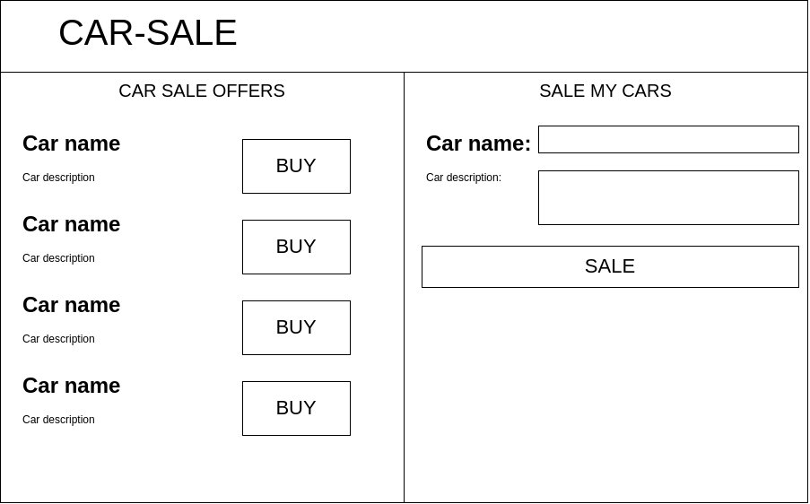

# car-sale

Учебный проект курса
[Kotlin Backend Developer](https://otus.ru/lessons/kotlin/?int_source=courses_catalog&int_term=programming).

Car-sale - это площадка, на которой пользователи могут как выставлять на продажу, так и покупать автомобили. 
Задача площадки - предоставить наиболее подходящие функции для всех участников данного вида торговых отношений: для покупателей - 
список актуальных объявлений, для продавцов - методы публикации объявлений.

## Документация

1. Маркетинг
    1. [Заинтересанты](./docs/marketing/stakeholders.md)
    2. [Целевая аудитория](./docs/marketing/target-audience.md)
    3. [Конкурентный анализ](./docs/marketing/concurrency.md)
    5. [Пользовательские истории](./docs/marketing/user-stories.md)
    6. [MVP](./docs/marketing/mvp.md)

2. DevOps
    1. [Схема инфракструктуры](./docs/devops/infrustructure.md)
    2. [Схема мониторинга](./docs/devops/monitoring.md)

## Визуальная схема фронтенда

